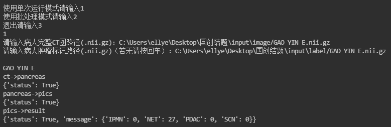
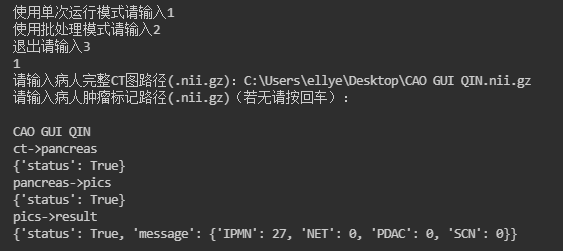
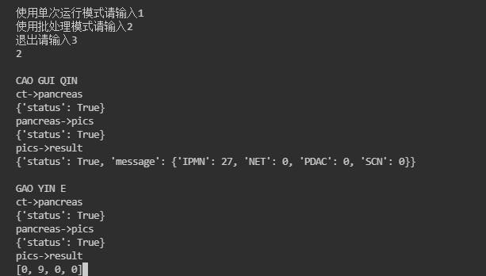
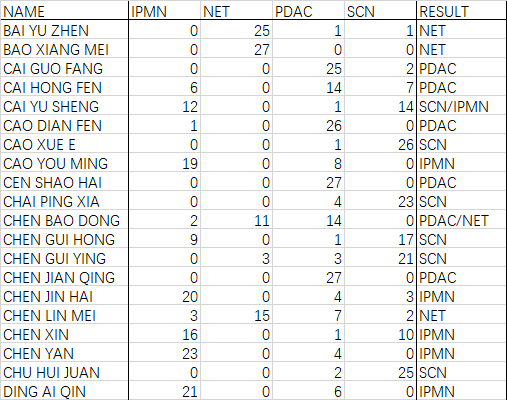

# CT图像处理系统

本系统接受病人的CT图像，运行程序后返回肿瘤预测结果。

本系统可同时接受由医生标注的肿瘤区域，以提高预测的准确率。

## 使用方式

1. 运行run.py
2. 指定病人完整CT图路径，向程序传入CT图。
   格式：nii.gz
   缺省值：input/image/[name].nii.gz
3. （可无）指定肿瘤标记CT图路径，向程序传入肿瘤区域。
   格式：nii.gz（与上同名）
   缺省值：input/label/[name].nii.gz
4. 等待程序输出预测结果

## 模块详细功能

### ct2pancreas

若指定肿瘤区域，则该模块将病人的CT图像以肿瘤为中心，裁切出200×200×200大小的CT图。

若未指定肿瘤区域，则该模块将调用胰腺器官识别网络，识别出胰腺，保存以胰腺为中心的胰腺CT图。

#### 输入
input/image/[name].nii.gz
病人的完整CT

input/label/[name].nii.gz
病人的医生标注的肿瘤区域（可无）

#### 输出

intermediate/image/[name].nii.gz
以肿瘤（或胰腺）为中心的CT

intermediate/label/[name].nii.gz
以肿瘤为中心的肿瘤区域（若传入了label）

### pancreas2pics

将上述处理过的CT图，根据图像大小自适应选取采样点（缺省为27个）。

以采样点为中心，自适应选择截面大小，以正交坐标系三个轴向为截面进行裁切，得到三张二维图像。

将三张二维图像分别写入RGB通道，合成为一张图像，作为预测所用的图片。

#### 输入
intermediate/image/[name].nii.gz
intermediate/label/[name].nii.gz

#### 输出
intermediate/pics/[name]/c[number].bmp
从CT截取的二维图像，用于预测。

### pics2result

将预测图像输入模型。

针对每张图像，本模块将调用所有（训练好的）模型，分别给出其预测结果（及置信度）。这些结果随后被喂入决策融合模型，后者给出（所有模型）针对这张预测图像的最终预测结果。

所有图像的预测结果获取完毕后进行加权，得到所有模型对该CT图的最终预测结果。其中，采样点越接近肿瘤中心的图像权值越高；若输入时未指定肿瘤区域，则所有图像权值相同。

最终预测结果（及置信度）通过程序运行界面（或控制台）输出。

#### 输入
model/densenet_model.pt
model/goolenet_model.pt
model/resnet_model_r1.pt
预测所使用到的所有模型

intermediate/pics/[name]/c[number].bmp

model/stacking.pt
决策融合所用的模型

#### 输出
单次运行模式：程序运行界面（或控制台）中输出预测结果以及置信度。

批量运行模式：输出至output/result.xls

## 程序特色

- 支持批量预测
- 使用决策融合技术，进一步提高预测准确率。

